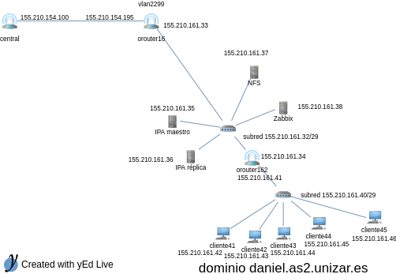

This work was a solution to a problem that came up in the subject's project System Administration 2. In that project I had to create two networks with different purposes. The first network had to be the servers network and the second the clients network. The servers network had to be composed by four servers:

- **FreeIPA master:** This server had to provided DNS, NTP, LDAP and Kerberos services.
- **FreeIPA slave:** This server had to be a slave for failure cases of the master.
- **NFS server:** A server for storing the users homes.
- **Zabbix server:** A Zabbix server for monitoring the clients and the servers.

The clients network had to have five clients that consumed these services. Both servers and clients were CentOS 7.2 machines.

My teacher gave to each student a network with which had to create these sub-networks. In particular my network was `155.210.161.32/28`. So, I only needed one bit for dividing this network in two sub-networks. The sub-network `155.210.161.32/29` was asigned to the servers and `155.210.161.40/29` to the clients. The networks were connected as follows.

The servers sub-network was connected to an existing gateway (`155.210.161.33`) and had a second that routed the packets to the clients sub-network (`155.210.161.41`). The servers had the next directions:

- `155.210.161.35` was the FreeIPA master.
- `155.210.161.36` was the FreeIPA slave.
- `155.210.161.37` was the NFS server.
- `155.210.161.38` was the Zabbix server.

To understand this better you can see the next diagram, also, you can see the ip address assigned to each client (the names are in spanish, so, if you don't understand, please use a translator):

